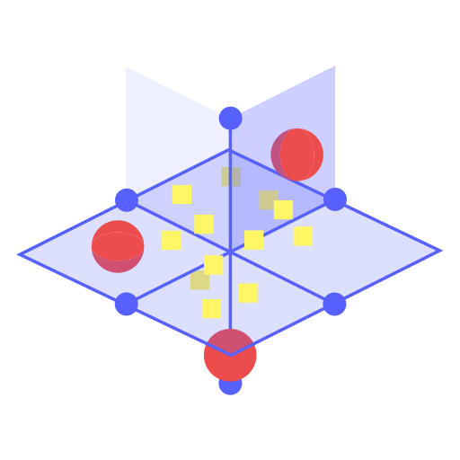
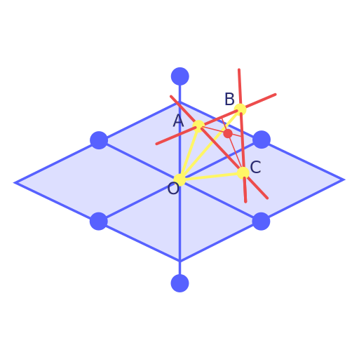
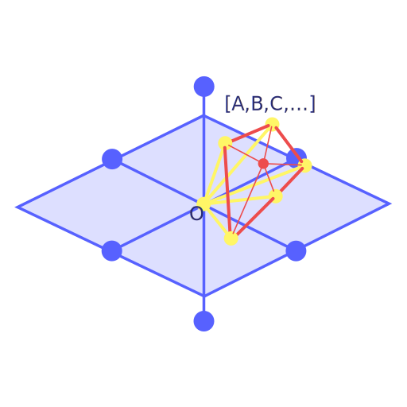
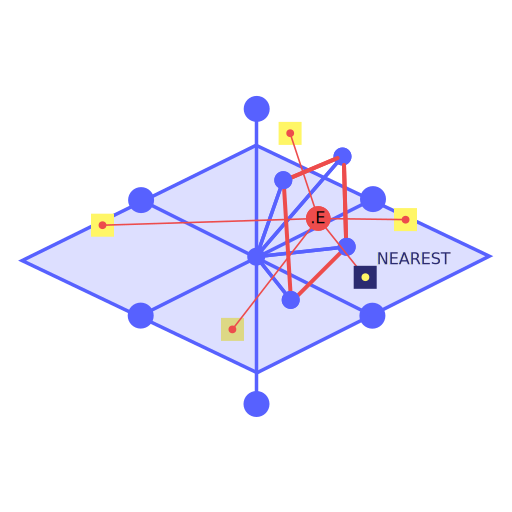
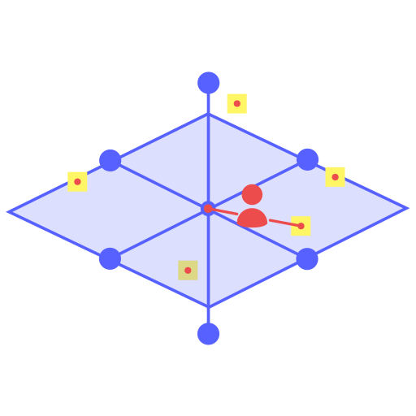
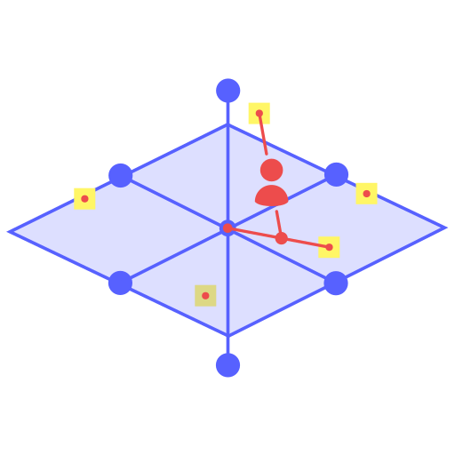
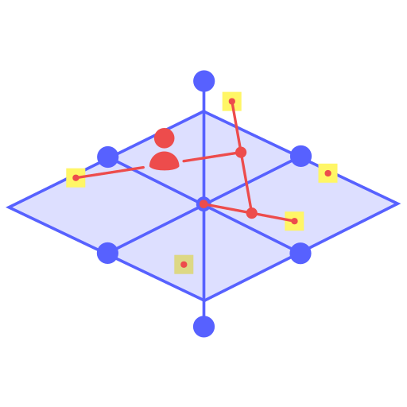
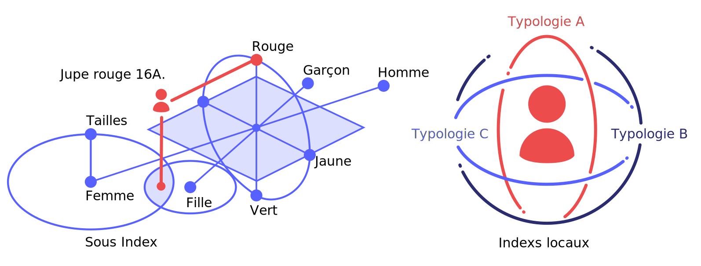

# WordLab


# aplologies
this package didn't work actually, i cant desable it at this time so am waching your downloads and i'll said you, DO NOT DOWNLOAD THIS PACKAGE cause the features are comming and actually its just a BULLSHIT.

> Attention! 
> WordLab est une approche totalement expérimentale de traitement d'indexes sur des jeux de textes.
> Je n'assure aucuune maintenance du package bien que je l'utilise pour mes propres besoins
> N'installe pas WordLab pour le moment car c'est en recherche et ça ne va pas fonctionner c'est certain.
> Il ne sert qu'à des recherches personnelles du moins tant que personne ne va proposer un fork sur GitHub.
> je ne pige pas les 130 downloads d'hier, calmos on avance et comme indiqué pour le moment c'est du BULLSHIT...

## C'est quoi ?

> Pour commencer ce README est en Français, étonant non ?
> 
> WordLab c'est un moyen de Classifier des données textuelles dans la langue de Molière...

## Comment ça fonctionne ?

> Tu envoies un gros JSON avec ton bordel en entrée
> Et WordLab te retourne un tout petit object en sortie avec l'ensemble de tes Textes classés par index sous forme de vecteurs 3D.
> C'est une sorte de mix entre Word2Vec et un KNN

> Maintenant que tu as ton jeu de données spacial, tu peux demander à WordLab pas mal de trucs comme :
>    - Donne moi les textes les plus proches d'une recherche par mots clés
>    - Liste moi les textes par ordre de similitude
>    - Et beaucoup d'autres trucs plutôt cool dont nous parlerons sur https://bige-start.web.app

> Le principal UseCase de WordLab c'est d'orienter des contenus selon le contexte d'utillisateurs
> En somme ça permet de déplacer des vecteurs et de connaître leurs positionnement dans un espace 3D
> Donc on peu avec WordLab créer différents contexts de façon à toujours répondre de façon pertinente 
> Et sans appels réseau surtout, WordLab ça sert à savoir quoi afficher à quel moment et pour qui...

> Pour plus d'infos je suis en train d'écrire un article sur WordLab ici :
> [LIRE L'ARTICLE](https://bige-start.web.app/feeds/wordlab-la-base-de-donnee-vectorielle-cree-specialement-pour-bige)

## installation

> Classique tu ajoute le package à ton projet
```
npm i @landscape/wordlab --save
```

## Exemple

> Ce qu'il te faut c'est un jeu de données en entrée pour donner à manger à WordLab 
> donc admettons tu as des articles de blogs dans un json qui ressemble à ça :

```javascript
const articles = [
    {
        "id": 1,
        "label": "Nom de ton premier article",
        "short_deescription": "description courte de ton permier article",
        "intro": "Long texte d'introduction de ton premier article",
        "categorie": "Ta catégorie 1"
    },
    {
        "id": 2,
        "label": "Nom de ton second article",
        "short_deescription": "description courte de ton second article",
        "intro": "Long texte d'introduction de ton second article",
        "categorie": "Ta catégorie 2"
    },
    ...
]
```

> Avec ton jeu de données tu vas créer ton dataset (des vecteurs 3D relatifs)

```javascript
const DB = new WordLab(
    articles,
    {
        scale: 100, // la taille de tes indexs
        keywords: ["label", "short_description", "intro"], // la liste des labels de type String à parser
        layers: { // les calques souhaités
            categories: "category"
        }, // words is setted by default
        index: "categories", // le nom de ton index (lorsqu'il n'y en a qu'un seul, oui oui on peu en avoir plusieurs...)
        clean: true // boolean that return only last position or each vectors evolutions
    },
    function(e, val) {
        console.log("WordLab Logger => ", e, val);
    }.bind(this)
);
this.wordLabDataset = this.DB.trainDataset();
```

> Maintenant que le plus difficile est fait, imagine que tu cherche un article par mot clé

```javascript
let order = DB.search("second");
```

> le fait de rechercher le mot "second" va te retourner un objet comme suit :

```json
{
    "2": {
        "distance":0,
        "weight":100
    },
    "1": {
        "distance":100,
        "weight":0
    }
}
```

> C'est tout, WordLab te retourne tes articles classés par ID ordonancés par distance et poids de l'index
> Forcément ici on a que deux articles donc on a des poids marqués à l'extrême 0 ou 100...

<div style="display:inline-flex">




</div>

## WordLab offre le bon contenu au bon moment au bon utiliisateur

> Lorsque WrodLab est monté sur un front-end, vous pouvez y ajouter différents vecteurs à la demande par exemple un utilisateur,
> considérons qu'un utilisateur entre sur votre site et commence à naviguer il va lire un article ou taper unue recherche ou encore effectuer tout autre type d'opérations
> vous pourriez essayer de traiter ça en envoyant des paquets de données sur sa navigation et orienter vos contenus en fonction,
> seulement ça sous entend de faire des traitements lourds côté serveur et comme (je vous le souhaite) votre serveur est déjà en bout de piste
> ça peut rapidiement devenir très couteux...
> WordLab va orienter vos utiliisateurs sans traitements serveur en le déplaçant de façon logique au travers de vos contenus.

<div style="display:inline-flex">




</div>


## WordLab travaille aussi sur des indexes multiples

> Rechercher sur un index c'est cool mais sur une multitude c'est encore mieux !
> C'est en cours de test mais imaginez la pertinence d'une liste d'articles sur un site e-commerce sans utiliser de puissance de calcul sur votre serveur !
> C'est ce que Bige WordLab est en train de tester pour vous...





> Author : Simon Delamarre

> License : MIT